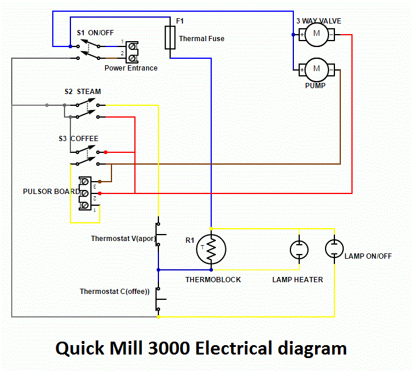
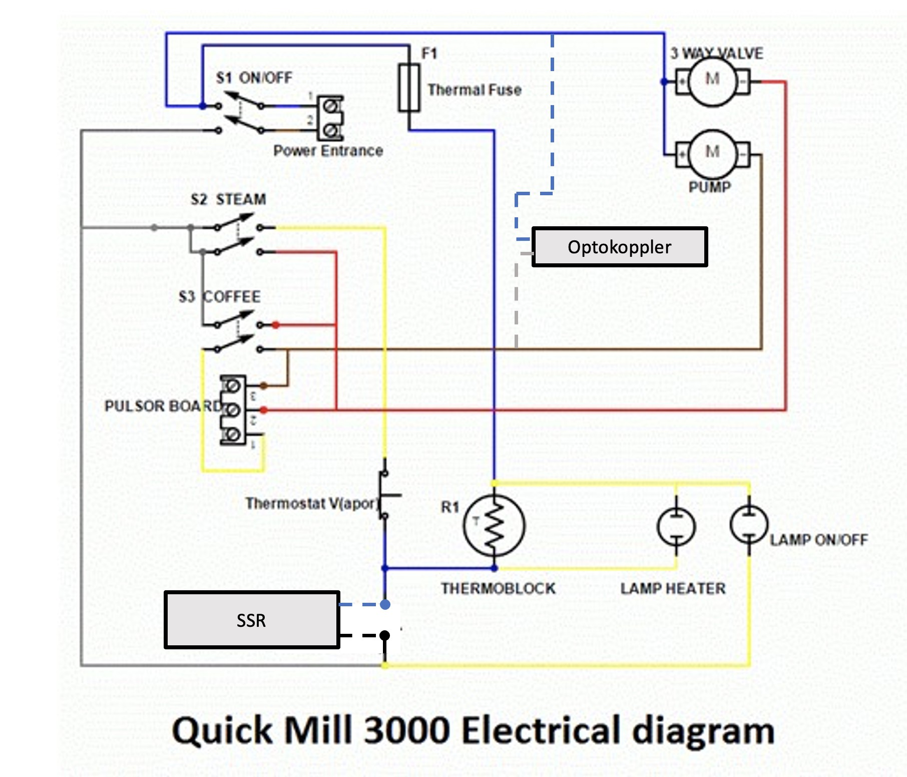

# Thermoblock - Anpassungen
{: .no_toc }

Inhaltsverzeichnis

* TOC
{:toc}

## Einleitung

Die PID lässt sich auch zur Steuerung von Thermoblock Maschinen einsetzen. Je nach Aufbau der Maschine muss die Steuerung angepasst werden. Details zu bereits erfolgten Umbauten und den in der PID umgesetzten Features werden im Folgenden beschrieben. 


## 1. Quick Mill Thermoblock Maschinen

### 1.1 Modelle
Aktuell lassen sich mit der PID die **Quick Mill 0820 (Stretta)**, die **Quick Mill 0835 (Retrò)** und die **Quick Mill 3000 (Orione)** steuern. Der Aufbau der drei Maschinen ist sehr ähnlich. Sie haben alle einen Thermoblock, der sowohl für den Bezug als auch für die Erzeugung von Dampf verwendet wird. 

### 1.2 Umbauvarianten
Es gibt derzeit zwei Umbauvarianten: 
* **PID Only**: Hier erfolgt die Erkennung eines Bezugs per Software. Dafür wird neben der Temperatur des Sensors auch die Temperaturänderungsrate überwacht. Da der Thermoblock erst mit dem Einschalten des Bezugsschalters mit (kaltem) Wasser gefüllt wird, lässt sich aus einer hohen Temperaturänderungsrate auf einen Bezug schließen.
 Um zu schäumen, muss in der Blynk-App zunächst manuell die Temperatursteuerung auf Dampfmodus umgestellt werden. Anschließend kann über den Dampf-Schalter Dampf bezogen werden.

* **PID Only Plus**: Hier erfolgt die Erkennung eines Bezugs und des Dampf-Modus direkt aus der Betätigung des Bezugs- bzw. des Dampfschalters mit Hilfe einer Software-Hardware-Lösung. Im Gegensatzu zu der PID Only Variante ist dafür der Einbau eines Optokopplers zur Überwachung der Pumpenspannung erforderlich.


### 1.3 Schaltpläne

#### Originalzustand
Der folgende Schaltplan (Quelle (https://www.koffiepraat.nl/forum/download/file.php?id=3718&sid=347497ff32b0a1b68d92d8acab0887d5&mode=view)) zeigt die Verschaltung der Quick Mill 3000. Der Schaltplan ist auch für die Modelle 0820 und 0835 repräsentativ. Bei dem Modell 0835 kommt zusätzlich noch die Steuerung der integrierten Mühle dazu, die aber unabhängig von dem hier dargestellten Schaltplan ist und darauf keinen Einfluss hat. 



Nicht im Detail dargestellt ist die Steuerung der Pumpe (Pulsor Board). Eine verbale Beschreibung findet man in dem [Thread "Schaltplan Quickmill Orione 3000" im Kaffee-Netz](https://www.kaffee-netz.de/threads/schaltplan-quickmill-orione-3000.137528/#post-1940051). 

Kurz zusammengefasst, wird die Pumpe auf zwei Wegen mit Strom versorgt:  
* **Bezugsmodus:** Über den geschlossenen Bezugsschalter (S3 Coffee) fließt der Strom in Pin 2, direkt weiter zu Pin 1 und dann wieder durch den Bezugsschalter in die Pumpe. 
* **Dampfmodus:** Über den geschlossenen Dampfschalter (S2 Steam) fließt der Strom in Pin 2. Das Board gibt über Pin 3 einen pulsierenden Strom an die Pumpe ab, so dass immer nur ein wenig Wasser in den Thermoblock gelangt und dort verdampft wird.


#### PID Only Plus

In dem folgenden Schaltplan sieht man die Verschaltung der beiden wesentlichen Bauteile für die Ausbaustufe PID Only Plus. Der Kaffee-Thermostat ist durch das SSR ersetzt und parallel zur Pumpe ist ein Optokoppler geschaltet. 




### 1.4 Softwaresteuerung bei PID Only Plus

Bei der Pid Only Plus Steuerung erkennt die PID, ob der Bezugsschalter (S3) oder der Dampfschalter (S2) geschaltet ist. Dazu ist parallel zur Pumpe ein 230V Optokoppler geschaltet. Je nach Optokopplertyp [(siehe Kapitel Brüherkennung)](http://manual.rancilio-pid.de/de/customization/brueherkennung.html) kann dann an PIN15 oder PIN16 des NodeMCU das Signal des Optokopplers (hier: als voltage sensor bezeichnet) abgegriffen werden, 
```
int pvs = digitalRead(PINVOLTAGESENSOR);

```
und entschieden werden, ob die Pumpe bestromt (unter Spannung) ist oder nicht. 

Um zu entscheiden, welcher der beiden Schalter, S3 oder S2, geschaltet sind, wechselt die Software in einen Monitoring-Modus, sobald Pumpenaktivität angezeigt wird
```
if (pvs == VoltageSensorON && ...)
  brewSteamDetectedQM = 1;
```
Dieser Modus bleibt solange aktiv, bis die Pumpe abschaltet. Erfolgt das Abschalten innerhalb von weniger als maxBrewDurationForSteamModeQM_ON Millisekunden, muss es sich um einen Stromimpuls gehandelt haben und es kann gefolgert werden, dass der Dampfschalter betätigt wurde
```
if (pvs == VoltageSensorOFF)
{
  if (millis() - timePVStoON < maxBrewDurationForSteamModeQM_ON)
  {
    // Dampfmodus
    ...
  }
} 
```
Andernfalls wird geprüft, ob die Pumpe lang genug (länger als maxBrewDurationForSteamModeQM_ON) kontinuierlich läuft, so dass gefolgert werden kann, dass der Bezugsschalter betätigt wurde
```
else if (millis() - timePVStoON > maxBrewDurationForSteamModeQM_ON)
{
  if (Input < BrewSetPoint + 2) 
  {
    // Bezugsmodus
	...
  } else {
    // Cooling Flush
	...
  }
}
```
Über die Fallunterscheidung wird abgefragt, ob es sich um einen echten Bezug (Tist < Tsoll + 2°C) oder um Abkühlspülen handelt. 
