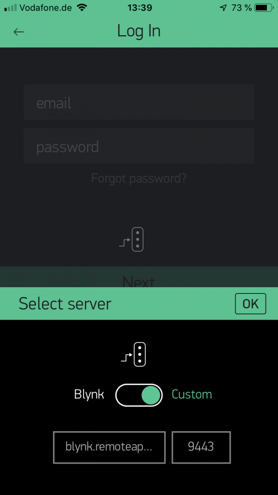
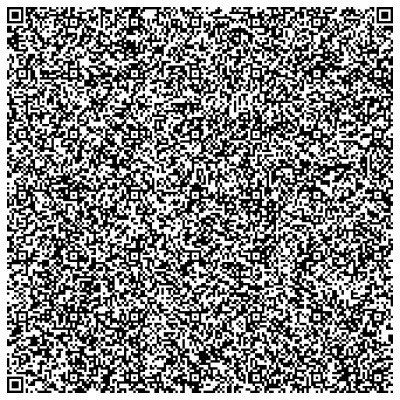
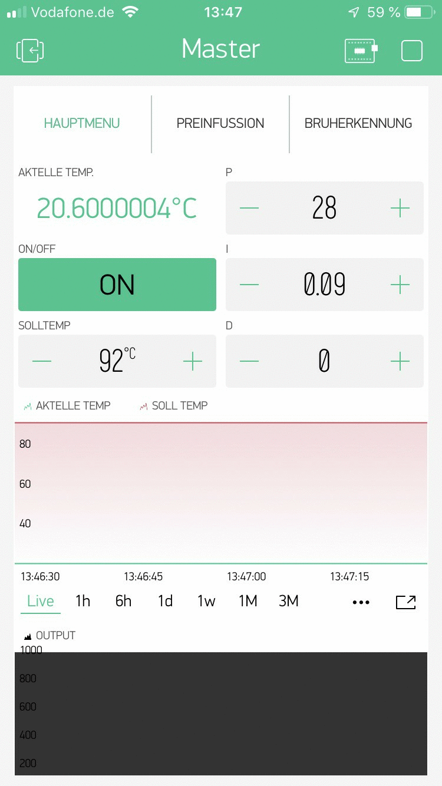
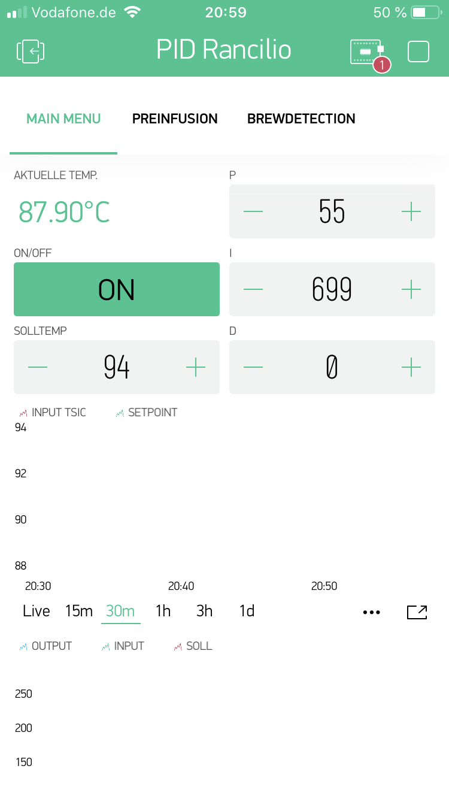
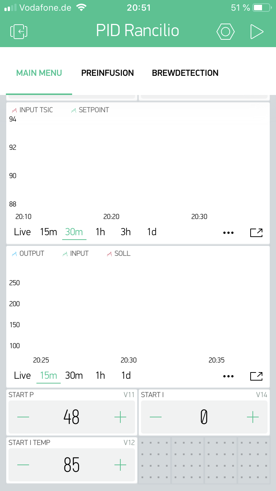
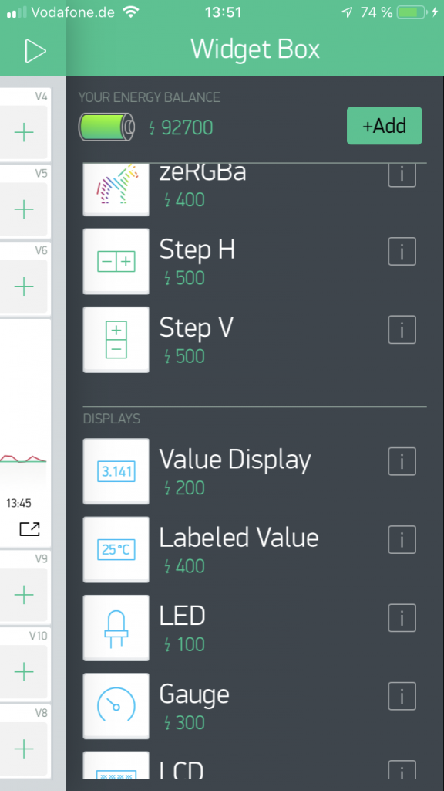
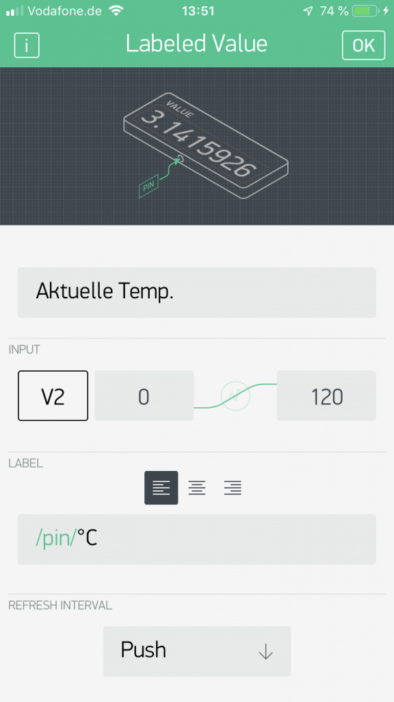

# Einrichtung von Blynk
{: .no_toc }

Inhaltsverzeichnis

* TOC
{:toc}

## Einleitung

Als nächstes richtet ihr zur Bedienung des PIDs auf eurem Smartphone die App Blynk ein. Blynk ist ein Cloud“-Dienst, über den der NodeMCU mit dem Handy oder Tablet steuerbar ist. Freundlicherweise steht uns ein eigener Blynk Server zur Verfügung, den Markus hostet. Natürlich könntet Ihr auch den Public Server von Blynk nutzen, hättet ggf. aber Kosten für das Einrichten der App.

Vom Prinzip funktioniert es wie folgt:

Die Maschine sendet Daten an einen Blynk-Server. Die App greift ebenfalls auf den Server zu und holt sich die benötigten Daten ab. Das Ganze funktioniert bidirektional: der Blynk-Server stellt einerseits die Parameter zum Betrieb des PIDs bereit, andererseits empfängt er auch vom PID die Daten zum aktuellen Betriebszustand der Maschine. Ein Auth Token stellt hierbei sicher, dass nur euere Maschine gesteuert wird.

Auch hierzu hat Markus ein Video auf Youtube, in dem die Installation gut erläutert wird.

## Video: Installieren und einrichten der Blynk App

## Schritt 1: App herunterladen

Siehe unter [https://www.blynk.cc/](https://www.blynk.cc/) gibt es für alle gängigen Betriebssysteme

## Schritt 2: Account anlegen

Öffnet hierzu die Blynk-App & Klickt auf „Create New Account“

Klickt jetzt zuerst auf das Ampel-Symbol um den Server zu wechseln!
Sonst nutzt Ihr den „normalen Blynk“-Server.

**WICHTIG**:

Legt den Schalter auf „Custom“ um.
Als Server tragt Ihr: blynk.clevercoffee.de
Port: 9443
Bestätigt die Eingabe mit „OK“

Ergänzt jetzt eure E-Mail-Adresse:
Und klickt im Fenster auf „Next“

Der Account ist nun angelegt.
Erstellt euer erstes Projekt mit dem Klick auf „New Project“

Hier könnt ihr auch direkt auf das Scan-Symbol oben rechts klicken und folgenden Code einscannen:

QR-Code für Android:

QR-Code für IOS:

(Dargestellte PID Werte entsprechen nicht mehr den neusten Stand)

oder die App selbst erstellen.

Gebt dem Projekt einen sinnvollen Namen.
Als Device wählt bitte "NodeMCU".

AuthKey auslesen (wird im Arduino benötigt).
Klickt hierzu auf das Viereck oben Rechts.

Klick jetzt auf das „Muttern“-Symbol

Im unteren Bereich – steht der Auth-Code.
Dieser kann auch via E-Mail angefragt werden.
Der Auth-Code ist sozusagen der Schlüssel, zwischen NodeMCU und deinem Handy/Server.
Dieser Code sollte „Geheim“ bleiben.

## Schritt 3: Auth Token hinterlegen

Authkey wird im 2. Schritt in der userConfig.h hinterlegt. Bei Auth kommt der Code aus Blynk hinein. Bei SSID und PASS euer Wlan Name und Passwort. Dazu gleich mehr.

## Schritt 4: Aufbau der App

Klickt oben Rechts wieder auf das Viereck um in den Bearbeitungsmodus zu gelangen. Ihr müsst leider alle virtuelle PINS manuell in der App hinterlegen.

Pin | Wert
-|-
V2 | Input (aktuelle Temp)
V3 | Soll-Temp
V4 | P-Wert (Übergabe von Blynk an NodeMCU)
V5 | I-Wert (Übergabe von Blynk an NodeMCU)
V6 | D-Wert (Übergabe von Blynk an NodeMCU)
V7 | Einstellbare Soll-Temp
V8 | Preinfussion Brewtime
V9 | Preinfussion Start
V10 | Preinfussion Pause
V11 | P-Wert für den Startvorgang
V12 | Zielwert für den Startvorgang in °C
V13 | On/Off Schaltet die PID aus (Heizung auch)
V14 | Start I für Startvorgang
|
V20 | PID P Wert von interne PID an Blynk
V21 | PID I Wert von interne PID an Blynk
V22 | PID D Wert von interne PID an Blynk
V23 | Output Wert der internen PID
|
V30 | Brüherkennung: P Wert
V31 | Brüherkennung: I Wert
V32 | Brüherkennung: D Wert
V33 | Zeit in der die Brüherkennungs PID Werte aktiv sind
V34 | Wert bei dem die Brüherkennung aktiviert wird
V35 | Brüherkennungs Durchschnittswert
V36 | Brüherkennungs minimalWert

Die App ist in Widgets aufgebaut – die Widgets können via Drag-and-Drop einfach von rechts aus der Widget-Box in die App gezogen werden.

Einem Widget kann jetzt der INPUT Pin mitgeteilt werden (Siehe Liste oben)

