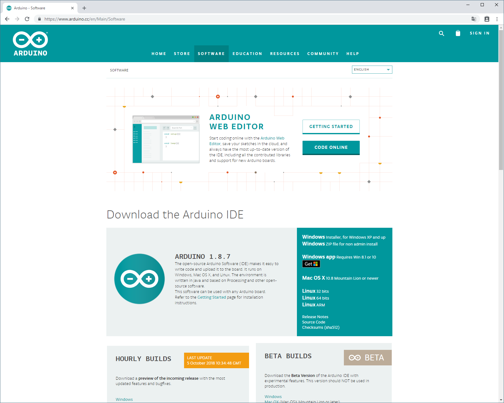
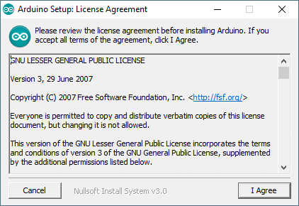
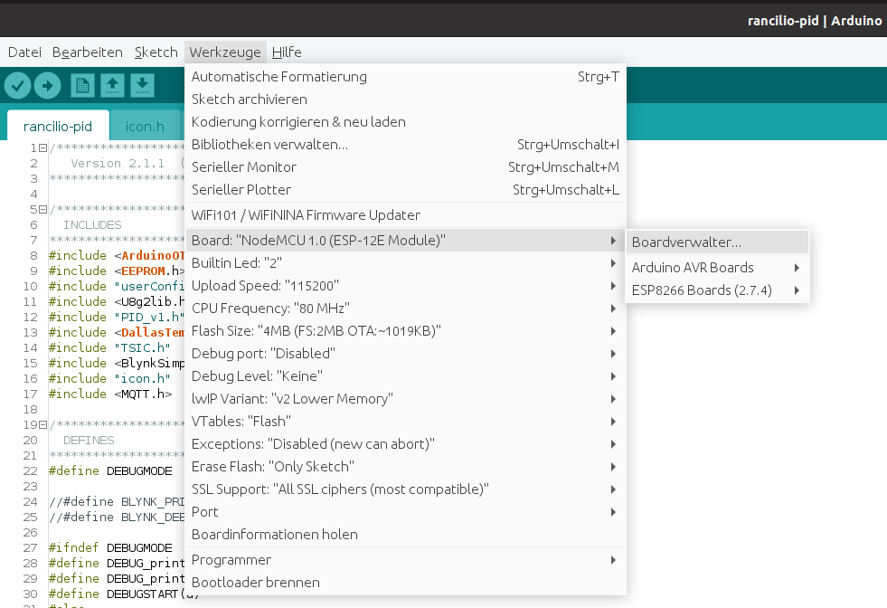
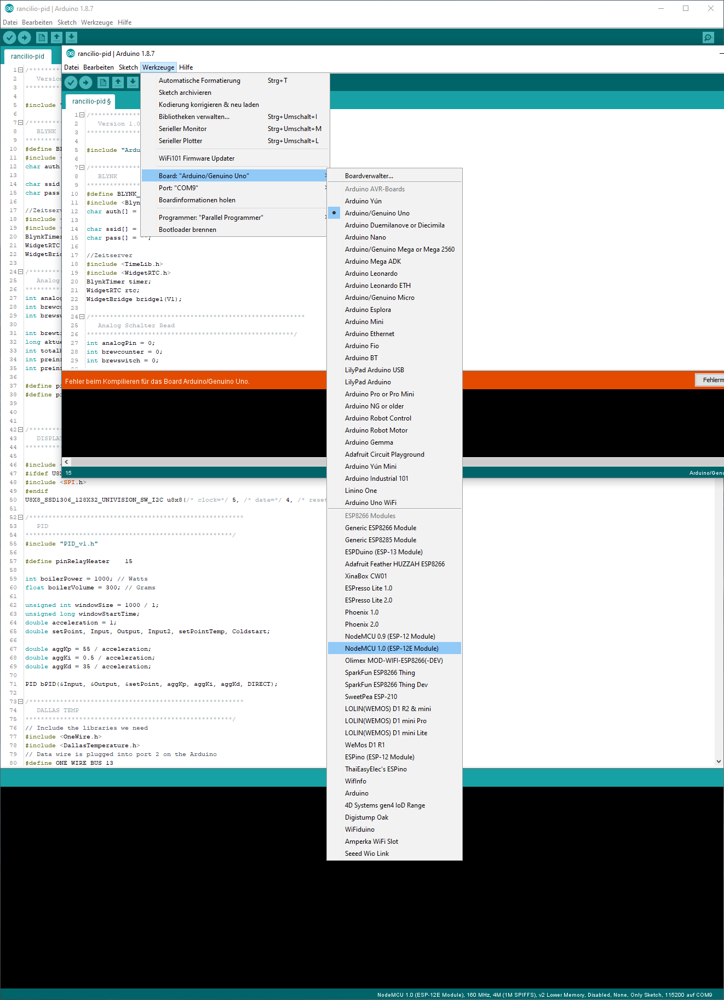
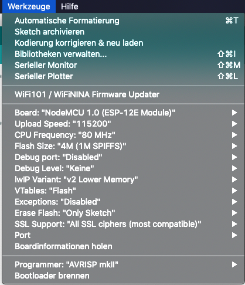
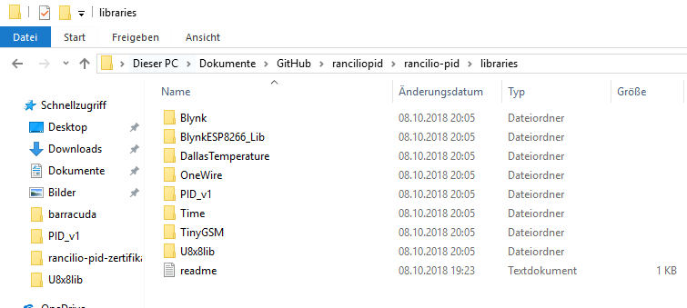

# Arduino IDE setup

{: .no_toc }
Contents

* TOC
{:toc}

## Installation video

In this short video we explain the installation of the Arduino IDE and also show how to install our OpenSource Rancilio-PID on the NodeMCU. Have fun!

## Download

Needed to transfer the program code onto the controller.

[Link to Arduino](https://www.arduino.cc/en/Main/Software)

## The program code

You can download the program code from the current release.

[Link to Github Repository](https://github.com/rancilio-pid/ranciliopid/releases)

## Installation of Arduino IDE

Help on how to install the Arduino IDE can be found at [Arduino Website](https://www.arduino.cc/en/Guide).

After succesful installation, Arduino IDE can be started from the Start menu

## Arduino preferences

### Boards Manager URL

Before we can use NodeMCU in Arduino IDE, we have to set up an additional Boards Manager URL

You can find it under: File > Preferences

| Key | Value |
|-|-|
| Boards Manager URL | `http://arduino.esp8266.com/stable/package_esp8266com_index.json`|

  
 Windows 

  

  
 Linux (Ubuntu) 

  

### installing board drivers

Drivers for ESP8266 have to be installed next.

You can find those under Tools > Board: "[\<Version\>]" > Boards Manager...

  
 Windows 

  

  
 Linux (Ubuntu) 

  

Please install the current version

Typ \<All\> > "esp": "**esp8266** by **ESP8266 Community**"

The Arduino IDE setup is done now, we will continue with the libraries

## installing libraries

The easiest and safest way to install all libraries correctly is to use the [libraries from Github](https://github.com/rancilio-pid/ranciliopid/tree/master/rancilio-pid/libraries). You should have downloaded them already (see [Programmcode](#the-program-code)). Just copy the whole folder into the Arduino libraries folder

| OS | Arduino Libraries Folder |
|-|-|
| Windows | `My Documents\Arduino\libraries\` |
| OSX | `~/Documents/Arduino/libraries/` |
| Linux |`~/Arduino/libraries`|

As usual, it is recommended to get more information from the official guide: [Link](https://www.arduino.cc/en/Guide/Libraries).

## Board setup

After all libraries have been installed, it should look like this:

Everything is now prepared for setting up Blynk and flashing of the actual code on the NodeMCU.
